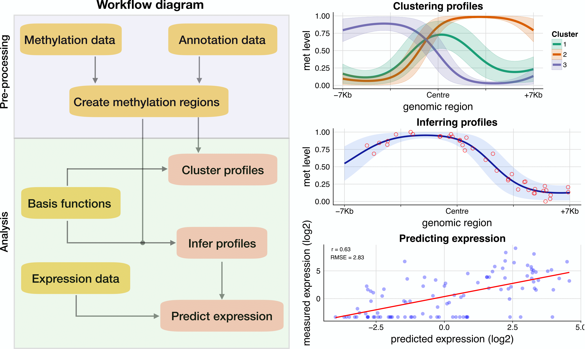

# BPRMeth: modelling DNA methylation profiles

The aim of `BPRMeth` is to extract higher order features associated with the shape of methylation profiles across a defined genomic region. Using these higher order features across promoter-proximal regions, BPRMeth provides a powerful machine learning predictor of gene expression. Check the vignette on how to use the package. Modelling details for the different models can be found online: [http://rpubs.com/cakapourani](http://rpubs.com/cakapourani).

The original implementation has now been enhanced in two important ways: we introduced a fast, __variational inference__ approach which enables the quantification of Bayesian posterior confidence measures on the model, and we adapted the method to use several observation models, making it suitable for a diverse range of platforms including __single-cell__ and __bulk__ sequencing experiments and __methylation arrays__. 


## Installation
To get the latest development version from Github:

```R
# install.packages("devtools")
devtools::install_github("andreaskapou/BPRMeth")
```

Or install from the release stable version Bioconductor
```R
## try http:// if https:// URLs are not supported
source("https://bioconductor.org/biocLite.R")
biocLite("BPRMeth")
```

## `BPRMeth` workflow

The diagram below shows an overview of the pre-processing and analysis workflow in `BPRMeth`, together with example output graphs.



## Citation
Kapourani, C.-A. and Sanguinetti, G. (2016). Higher order methylation features for clustering and prediction in epigenomic studies. Bioinformatics 32 (17), i405-i412. **(Best Paper Award
in ECCB 2016)**.
