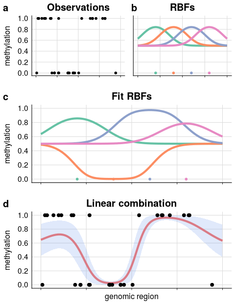
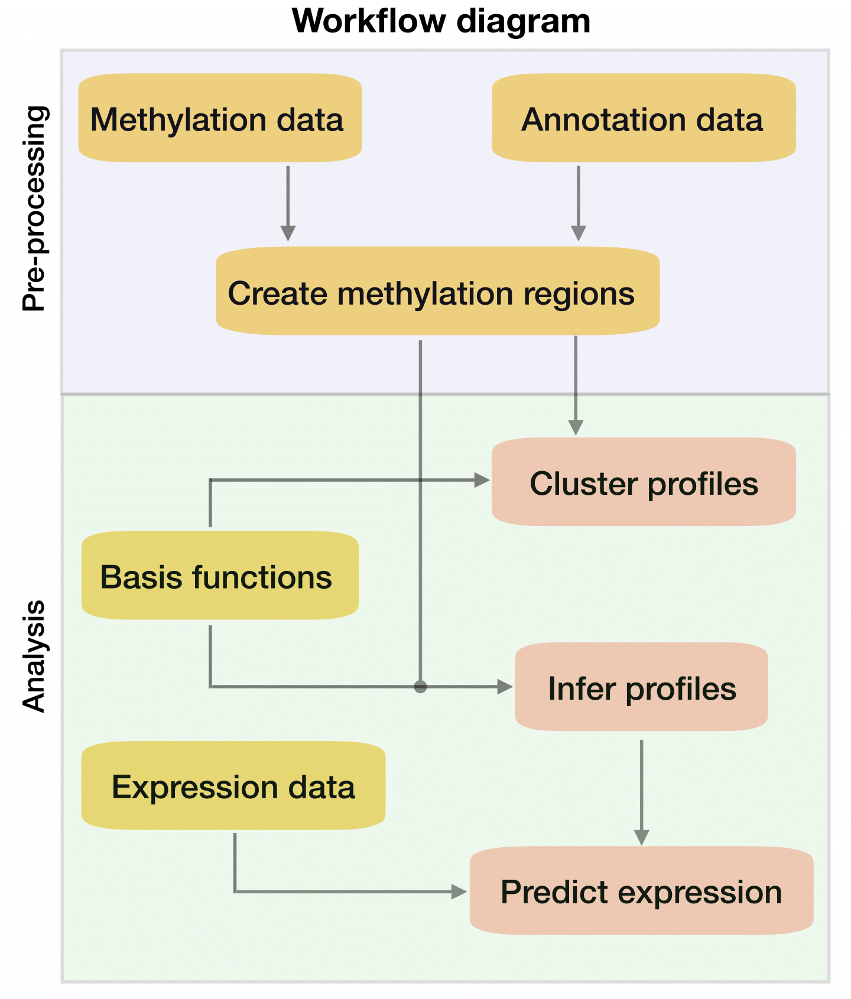

# Installation
```{r installation, echo=TRUE, eval=FALSE}
## try http:// if https:// URLs are not supported
source("https://bioconductor.org/biocLite.R")
biocLite("BPRMeth")

## Or download from Github repository
# install.packages("devtools")
devtools::install_github("andreaskapou/BPRMeth", build_vignettes = TRUE)
```

# Introduction
DNA methylation is probably the best studied epigenomic mark, due to its well established heritability and  widespread association with diseases. Yet its role in gene regulation, and the molecular mechanisms underpinning its association with diseases, are still imperfectly understood. While the methylation status of individual cytosines can sometimes be informative, several recent papers have shown that the functional role of DNA methylation is better captured by a quantitative analysis of the __spatial variation__ of methylation across a genomic region.

The `BPRMeth` package is a probabilistic method to quantify explicit features of methylation profiles, in a way that would make it easier to formally use such profiles in downstream modelling efforts, such as predicting gene expression levels or clustering genomic regions according to their methylation profiles. The original implementation has now been enhanced in two important ways: we introduced a fast, __variational inference__ approach which enables the quantification of Bayesian posterior confidence measures on the model, and we adapted the method to use several observation models, making it suitable for a diverse range of platforms including __single-cell__ analyses and __methylation arrays__. 

In addition to being a flexible tool for methylation data, the proposed framework is in principle deployable to other measurements with a similar structure, and indeed the method was already used for single-cell __chromatin accessibility__ data in [2].

# Background
Mathematically, the `BPRMeth` is based on a basis function generalised linear model. The basic idea is as follows: the methylation profile associated to a genomic region $D$ is defined as a (latent) function $f\colon D\rightarrow (0,1)$ which takes as input the genomic coordinate along the region and returns the propensity for that locus to be methylated. In order to enforce spatial smoothness, and to obtain a compact representation for this function in terms of interpretable features, we represent the profile function as a linear combination of basis functions

$$
f(x)=\Phi\left(\mathbf{w}^Th(x)\right)
$$

where $h(x)$ are the basis functions (Gaussian bells by default), and $\Phi$ is a probit transformation (Gaussian cumulative distribution function) needed in order to map the function output to the $(0,1)$ interval. The latent function is observed at specific loci through a noise model which encapsulates the experimental technology. 

```{r, fig.retina = NULL, fig.align='center', fig.cap="Illustration of the process for infering methylation profiles using the `BPRMeth` package.", echo=FALSE}

```

The optimal weight parameters $\mathbf{w}$ can be recovered either by Bayesian inference or maximum likelihood estimation, providing a set of quantitative features which can be used in downstream models: in [1] these features were used in a machine learning predictor of gene expression, and to cluster genomic regions according to their methylation profiles. Modelling details and mathematical derivations for the different models can be found online: [http://rpubs.com/cakapourani](http://rpubs.com/cakapourani).

# Analysis Pipeline
The workflow diagram and functionalities of the `BPRMeth` package for analysis methylation profiles are shown below

```{r, fig.retina = NULL, fig.align='center', fig.cap="Workflow diagram and functionalities of the BPRMeth package.", echo=FALSE}

```

## Sample data
To illustrate the functionality of the `BPRMeth` package we will use real datasets that are publicly available from the ENCODE project consortium [2]. More specifically we will focus on the K562 immortalized cell line, with GEO: GSE27584 for the bulk RRBS data and GEO: GSE33480 for the RNA-Seq data. We will use directly the preprocessed files,
where we have kept only the protein coding genes, and for the purpose of this vignette we focus only on \verb|chr12| and \verb|chr13|. Full details of where to download the data and how to preprocess them are included in the Supplementary Material [1].

## Load preprocessed data
Due to its general approach, `BPRMeth` can be used for a wide range of technologies such as array based, bulk sequencing (both RRBS and WGBS) and single cell sequencing methylation datasets. It is only required that the data are in the right format and we call the appropriate observation model depending on the type of technology. Since the encode data are generated from __bulk__ RRBS experiments, the observation model for the `BPRMeth` package will be __Binomial__.

### Methylation data
The `BPRMeth` package provides methods for reading files for methylation, annotation and expression data, however they do not cover all possible data formats available for describing biological datasets. The user can implement his own methods for reading files with different formats, provided that he can create an object similar to what is described below. First, we load the preprocessed methylation data as follows:
```{r load_met, echo=TRUE, message=FALSE, warning=FALSE}
library(BPRMeth)  # Load package
met_region <- encode_met
```
The `met_region` object contains the following important slots:

* `met`: A list containing the methylation region, where each element of the list is a different genomic region. More specifically, each methylation promoter region is an $L_{i} \times 3$ dimensional matrix, where $L_{i}$ denotes the number of CpGs found in region $i$. The columns contain the following information:
    + 1st column: Contains the locations of CpGs relative to central location. Note that the actual locations are scaled to the (-1, 1) region.
    + 2nd column: Contains the total reads of each CpG.
    + 3rd column: Contains the methylated reads each CpG.
* `anno`: Corresponding annotation data for each genomic region as `r Biocpkg("GRanges")` object. The `anno` slot is only required for downstream analysis, e.g. to predict gene expression levels from methylation profiles, since we need to map the genomic regions with the gene IDs.

To create this object someone should follow these steps ( __Do not run__ )
```{r read_met_dt_pipeline, echo=TRUE, message=FALSE, eval=FALSE}
# Read bulk methylation data
met_dt <- read_met(file = "met_file", type = "bulk_seq")
# Read annotation file, which will create annotation regions as well
anno_dt <- read_anno(file = "anno_file")
# Create methylation regions that have CpG coverage
met_region <- create_region_object(met_dt = met_dt, anno_dt = anno_dt)
```

Now let's observe the format of the `met_region` object. For example, we can access the $20^{th}$ promoter methylation region as follows
```{r, echo=TRUE, message=FALSE, warning=FALSE}
head(met_region$met[[20]])
```
Below are the annotation data
```{r, echo=TRUE, message=FALSE, warning=FALSE}
head(met_region$anno)
```
and the total number of genomic regions are
```{r, echo=TRUE, message=FALSE, warning=FALSE}
NROW(met_region$anno)
```

### Expression data
When using the `BPRMeth` package, someone most probably want to relate the inferred methylation profiles with gene expression data. To do this we have pre-processed expression data which can be loaded as follows
```{r, echo=TRUE, message=FALSE, warning=FALSE}
expr <- encode_expr
```
The structure of the expression data is rather simple, it is a `r CRANpkg("data.table")` with two columns as shown below
```{r, echo=TRUE, message=FALSE, warning=FALSE}
head(expr)
```

To create the expression data (which are $log_{2}$ transformed) we could call ( __Do not run__ )
```{r, echo=TRUE, message=FALSE, eval=FALSE, warning=FALSE}
# Read expression data and log2 transform them
expr <- read_expr(file = "expr_file", log2_transf = TRUE)
```


## Create basis objects
For each genomic region, we will learn a methylation profile using the Binomial observation model with a specified number of __Radial Basis Functions (RBFs)__ $M$. For a single input variable $x$, the RBF takes the form $h_{j}(x) = exp(-\gamma || x - \mu_{j} ||^2)$, where $\mu_{j}$ denotes the location of the $j^{th}$ basis function in the input space and $\gamma$ controls the spatial scale. The case when $M = 0$ is equivalent to learning the mena methylation rate for the given region (i.e. learn a constant function).

For our running example, we will create two RBF objects, one with 5 basis functions and the other with 0 basis functions denoting the mean methylation rate
```{r create_basis, echo=TRUE, message=FALSE, warning=FALSE}
# Create RBF basis object with 5 RBFs
basis_profile <- create_rbf_object(M = 5)
# Create RBF basis object with 0 RBFs, i.e. constant function
basis_mean <- create_rbf_object(M = 0)
```

The `rbf` object contains information such as the centre locations $\mu_{j}$ and the value of the spatial scale parameter $\gamma$
```{r show_basis, echo=TRUE, message=FALSE, warning=FALSE}
# Show the slots of the 'rbf' object
basis_profile
```
The $\gamma$ is computed by the number of bases $M$, however the user can tune it according to his liking. Except from RBF basis, the `BPRMeth` pacakge provides __polynomial__ and __Fourier__ basis functions which can be created with the `create_polynomial_object` and `create_fourier_object` functions, respectively.

## Inferring methylation profiles
Learning the methylation profiles is equivalent to inferring the model parameters $\mathbf{W}$ of the __generalised linear regression__ model. These parameters can be considered as the extracted features which quantitate precisely notions of shape of a methylation profile. 

For performing parameter inference, the `BPRMeth` package is enhanced to provide both maximum likelihood estimation and Bayesian inference for the parameters. Specifically, for Bayesian estimation it provides an efficient __mean-field variational inference (Variational Bayes)__ and a __Gibbs sampling__ algorithm. For computational efficiency one should choose the VB implementation (Note that for Beta observation models, one should use MLE to infer the profiles, since currently the package does not provide Bayesian treatment for Beta likelihood).

To infer the methylation profiles using __MLE__ we need to call the `infer_profiles_mle` function
```{r infer_profiles, echo=TRUE, message=FALSE, warning=FALSE}
fit_profiles <- infer_profiles_mle(X = met_region$met, model = "binomial",
                               basis = basis_profile, is_parallel = FALSE)

fit_mean <- infer_profiles_mle(X = met_region$met, model = "binomial", 
                              basis = basis_mean, is_parallel = FALSE)
```

This results in a `infer_profiles` object whose most important slot is the inferred weight matrix `W`, below we show the structure of the `fit_profiles` object
```{r show_infer_object, echo=TRUE, message=FALSE, warning=FALSE}
# Show structure of fit_profiles object
str(fit_profiles, max.level = 1)
```

Below we show an example promoter region together with the fitted methylation profiles, where the points represent the DNA methylation level of each CpG site. The shape of the methylation profiles is captured by the blue curve, whereas the red line denotes the mean methylation rate
```{r plotprofile, echo=TRUE, fig.cap="Inferring methylation profiles. Methylation pattern for specific genomic region over +/-7kb promoter region.", message=FALSE, eval=TRUE, warning=FALSE}
# Choose promoter region 21 -> i.e. LEPREL2 gene
gene_id <- met_region$anno$id[21]
p <- plot_infer_profiles(region = 21, obj_prof = fit_profiles,
                         obj_mean = fit_mean, obs = met_region$met, 
                         title = paste0("Gene ID ", gene_id))
print(p)
```


## Applications
### Predicting gene expression
To quantitatively predict expression at each region, we construct a regression model by taking as input the higher-order methylation features learned from the `infer_profiles_vb`. In addition to these features, we consider two supplementary sources of information: (1) the goodness of fit in RMSE and (2) the CpG density. For our analysis an SVM regression model is considered. We will use $70\%$ of the data for training, and we will test the model's performance on the remaining $30\%$.

All the aforementioned steps are assembled in the `predict_expr` wrapper function:
```{r predictexpr, echo=TRUE, message=FALSE, warning=FALSE, warning=FALSE}
# Set seed for reproducible results
set.seed(123)
# Perform predictions using methylation profiles
pred_profile <- predict_expr(prof_obj = fit_profiles, expr = expr,
                             anno = met_region$anno, model_name = "svm",
                             fit_feature = "RMSE", cov_feature = TRUE, 
                             is_summary = FALSE)
# Perform predictions using mean methylation rate
pred_mean <- predict_expr(prof_obj = fit_mean, expr = expr, 
                          anno = met_region$anno, model_name = "svm",
                          is_summary = FALSE)
```

We can now compare the Pearson's correlation coefficient $r$ for both models and observe that the higher-order methylation features achieve test correlations twice as large compared to mean methylation rate. Note that someone should use cross-validaion to get a better estimate of the correlation performance.
```{r l9, echo=TRUE, message=FALSE, warning=FALSE}
print(paste("Profile r: ", round(pred_profile$test_errors$pcc, 2)))
print(paste("Mean r:", round(pred_mean$test_errors$pcc, 2)))
```

Below in Figure \@ref(fig:plotpred) we show a scatter plot of the predicted and measured expression values for the \verb|chr12| and \verb|chr13| of the K562 cell line.
```{r plotpred, echo=TRUE, fig.cap="Relationship between DNA methylation patterns and gene expression. Scatter plots of predicted versus measured (log2-transformed) gene expression values using profiles (left) and rates (right); each shaded blue dot represents a different gene, The red line indicates the linear fit between the predicted and measured expression values.", fig.wide=TRUE, message=FALSE, eval=TRUE, warning=FALSE}
g1 <- plot_predicted_expr(pred_obj = pred_profile, 
                          title = "Methylation profile")
g2 <- plot_predicted_expr(pred_obj = pred_mean, 
                          title = "Methylation rate")
g <- cowplot::plot_grid(g1, g2, ncol = 2, nrow = 1)
print(g)
```


### Clustering methylation profiles
Another application of the `BPRMeth` model is to use the higher-order methylation features to cluster DNA methylation patterns across genomic regions and examine whether distinct methylation profiles are associated to different gene expression levels. To cluster methylation profiles, a mixture modelling approach is considered and we perform inference either via EM algorithm (MLE estimates) or using the mean-field variational inference (Variational Bayes VB) model. In this example we will use the VB model to perform variational inference.

The `BPRMeth` package provides the `cluster_profiles_vb` function for performing Bayesian clustering, where the user needs to provide the number of clusters $K$, the methylation regions $X$, the observation model and a basis object. For efficiency we run on 20 VB iterations.
```{r clustering, echo=TRUE, message=FALSE, eval=TRUE, warning=FALSE}
# Set seed for reproducible results
set.seed(1) 
# Create basis object
basis_obj <- create_rbf_object(M = 3)
# Set number of clusters to 3
K <- 3
# Perform clustering
cl_obj <- cluster_profiles_vb(X = met_region$met, K = K, 
                              model = "binomial", basis = basis_obj, 
                              vb_max_iter = 20)
```


Figure \@ref(fig:clusterplot) shows the fitted methylation profiles for each cluster.
```{r clusterplot, echo=TRUE, fig.cap="Clustering methylation profiles across promoter-proximal regions. __Top__: Five clustered methylation profiles over +/-7kb promoter region w.r.t. TSS in the direction of transcription. Each methylation profile is modelled using three RBFs. __Bottom__: Boxplots with the corresponding expression levels of the protein-coding genes assigned to each cluster.", message=FALSE, eval=TRUE, warning=FALSE, fig.height=10}
g1 <- plot_cluster_profiles(cluster_obj = cl_obj)
g2 <- boxplot_cluster_expr(cluster_obj = cl_obj, expr = expr, 
                           anno = met_region$anno)
g <- cowplot::plot_grid(g1, g2, ncol = 1, nrow = 2)
print(g)
```


# Session Info
This vignette was compiled using:
```{r session_info, echo=TRUE, message=FALSE}
sessionInfo()
```

# Bibliography
[1] Kapourani, C. A., & Sanguinetti, G. (2016). Higher order methylation features for clustering and prediction in epigenomic studies. __Bioinformatics__, 32(17), i405-i412.

[2] Clark, S. J., Argelaguet, R., Kapourani, C. A., Stubbs, T. M., Lee, H. J., Krueger, F., Sanguinetti, G., Kelsey, G., Marioni, J.C., Stegle, O. and Reik, W (2017). Joint Profiling Of Chromatin Accessibility, DNA Methylation And Transcription In Single Cells. __bioRxiv__, 138685.

[3] ENCODE Project Consortium. (2012). An integrated encyclopedia of DNA elements in the human genome. __Nature__, 489(7414), 57-74.

# Acknowledgements
This package was developed at the University of Edinburgh in the School of Informatics, with support from Guido
Sanguinetti.

This study was supported in part by the EPSRC Centre for Doctoral Training in Data Science, funded by the UK Engineering and Physical Sciences Research Council (grant EP/L016427/1) and the University of Edinburgh, and by the European Research Council through grant MLCS306999.
